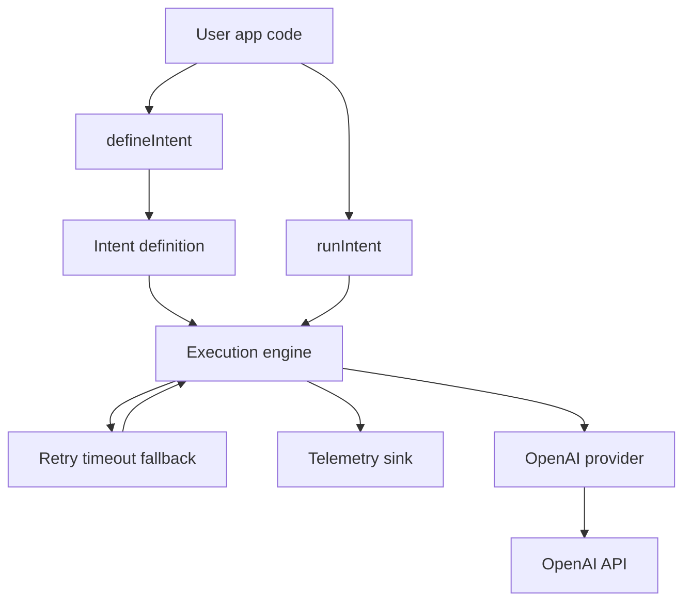

# fabricks-ai-reliability-layer
 Intent-based reliability primitives for LLM workflows — retries, timeouts, fallbacks, and telemetry in a tiny TypeScript library.

 ## Why and what this package solves

Modern LLMs are powerful but unpredictable: they time out, rate-limit, drift in quality, and occasionally fail without warning.  
Most developers end up hand-rolling ad-hoc retries, timeouts, and fallbacks scattered across their codebase — fragile, inconsistent, and hard to debug.

**AI Reliability Layer** provides a clean, intent-based way to describe *what you want the model to do*, while the library handles *how to do it reliably*.

It solves three core problems:

1. **Flaky LLM calls**  
   Built-in retry, timeout, and fallback policies turn unreliable model calls into stable execution paths.

2. **Scattered error handling**  
   Reliability logic is centralized, deterministic, and observable — no more copy-pasted try/catch blocks.

3. **Lack of visibility**  
   Every step emits structured telemetry, so you can trace exactly what happened, why, and how long it took.

In short:  
**You focus on your workflow’s intent.  
The library guarantees it runs predictably.**

## Features at a glance

- **Intent-based workflow definition** — describe what your workflow should do, not how to orchestrate it.
- **Retries, timeouts, and fallbacks built in** — turn flaky LLM calls into dependable execution paths.
- **Deterministic execution engine** — every run produces a clear, ordered trace of what happened.
- **Structured telemetry events** — observe step starts, successes, failures, retries, and fallbacks in real time.
- **Lightweight OpenAI provider** — a tiny adapter for making reliable model calls without heavy SDKs.
- **Minimal API surface** — define an intent, run it, inspect the result; no infrastructure required.
- **Test-friendly by design** — inject fake providers or override execution behavior for unit tests.
- **Small, focused, and fast** — under-the-hood complexity stays invisible so you can ship reliable workflows quickly.

## Quick start

Install the package:

```bash
npm install ai-reliability-layer

import { defineIntent, runIntent } from "ai-reliability-layer";

const getAnswer = defineIntent({
  name: "getAnswer",
  steps: [
    {
      id: "primary",
      run: async (ctx) =>
        ctx.providers.openai.chat({
          model: "gpt-4.1-mini",
          messages: [
            { role: "system", content: "You are a concise assistant." },
            { role: "user", content: ctx.input.question },
          ],
        }),
      retry: { maxAttempts: 2 },
      timeoutMs: 5000,
      fallbackTo: "fallback",
    },
    {
      id: "fallback",
      run: async (ctx) =>
        ctx.providers.openai.chat({
          model: "gpt-4o-mini",
          messages: [
            { role: "system", content: "Fallback model. Be brief." },
            { role: "user", content: ctx.input.question },
          ],
        }),
    },
  ],
});

const result = await runIntent(getAnswer, {
  question: "Why Kaniko over DinD?",
});

console.log(result);
```

## Core concepts

AI Reliability Layer is intentionally small. It’s built around a few core ideas that make LLM workflows predictable, observable, and easy to reason about.

---
## Architecture overview


### **Intents**

An **intent** describes *what you want your workflow to accomplish* — not the low-level mechanics of making the model behave.

It consists of a named collection of ordered steps, each representing a meaningful action in your workflow (e.g., “call the primary model,” “sanitize output,” “fallback to a cheaper model”).

You define intents with `defineIntent()`, and the library guarantees deterministic, reliability-aware execution.

---

### **Steps**

A **step** is the smallest unit of work in an intent.

Each step declares:

- an `id`  
- a `run(ctx)` function  
- optional `retry` policy  
- optional `timeoutMs`  
- optional `fallbackTo` another step  

Steps form a small DAG, where fallback paths create branching execution flows.

---

### **Reliability policies**

Every step can declare basic reliability rules:

- **Retry** — how many attempts to make before giving up  
- **Timeout** — how long the step is allowed to run  
- **Fallback** — which step to jump to if the primary path fails  

These policies turn flaky model calls into stable, predictable pathways.

---

### **Execution context (`ctx`)**

Each step receives a `ctx` object with:

- **input** — the data passed to `runIntent()`  
- **providers** — such as `ctx.providers.openai`  
- **metada**

## OpenAI provider

AI Reliability Layer includes a minimal OpenAI-style provider that exposes a single method:

```ts
ctx.providers.openai.chat({
  model: string;
  messages: { role: string; content: string }[];
}) 
```

## Examples

<!-- Links or snippets for:
  - Basic intent with fallback
  - Intent with retry + timeout
  - Testing with a fake provider
-->

---

## Design philosophy

AI systems fail in ways traditional software doesn't: they time out, return inconsistent results, exceed rate limits, or degrade silently as models evolve.  
The goal of this library is to give developers a **reliability-first foundation** for building predictable AI workflows using simple, intent-based abstractions.

At its core, AI Reliability Layer follows three principles:

1. **Intent over mechanics**  
   You describe *what* your workflow should accomplish.  
   The engine decides *how* to execute it safely — with retries, timeouts, fallbacks, and clear telemetry.

2. **Small surface area, strong guarantees**  
   Instead of a heavy workflow platform, this library focuses on the primitives that matter most:  
   deterministic execution, graceful degradation, and transparent observability.  
   This keeps the package easy to learn, easy to test, and easy to trust.

3. **Business resilience as a first-class goal**  
   Reliable AI behavior directly maps to business outcomes:  
   fewer failed requests, lower latency variability, predictable costs, and safer user-facing experiences.  
   As organizations integrate more LLMs into critical paths, these guarantees compound into real operational stability.

Looking ahead, reliability layers like this will become a **standard architectural building block** in AI applications — the same way queues, retries, and circuit breakers became foundational in distributed systems.  
This library demonstrates that future, starting from a minimal, elegant core.

## What’s intentionally not included (and why)

To keep the v1 release focused, reliable, and easy to adopt, several powerful features were deliberately **excluded** from the MVP. These will be added in future versions, but only once the core intent engine is stable and well-tested.

### ❌ YAML workflow definitions  
**Why not in MVP:**  
YAML introduces a full configuration surface area: schema validation, better error messages, type-safe loaders, ambiguous user expectations, and cross-platform parsing concerns.  
This increases complexity without improving the core reliability story.

**How it will be added:**  
Once the JS API is proven, YAML will layer cleanly on top as a declarative syntax that compiles into the same internal intent representation. This preserves reliability while adding ergonomic configuration for larger workflows.

---

### ❌ Full DAG execution (fan-out, fan-in, branching, cycle detection)  
**Why not in MVP:**  
A production DAG engine requires dependency resolution, topological sorting, cycle detection, and error propagation rules. That’s a separate reliability product on its own.  
MVP workflows rarely need branching beyond a fallback path.

**How it will be added:**  
The internal architecture already models steps as nodes; expanding to a full DAG is a natural evolution:  
- `dependsOn` support  
- static cycle detection  
- parallelizable branches  
- multi-path coordination  
Future versions will upgrade the engine without changing the public API.

---

### ❌ Parallel execution  
**Why not in MVP:**  
Parallel execution adds concurrency control, cancellation strategy, and race-condition observability — unnecessary for the smallest reliable intent engine.

**How it will be added:**  
A parallel scheduler will sit behind the same intent definition, using a worker pool or Promise-based concurrency limits.

---

### ❌ Multi-provider orchestration (Anthropic, HTTP steps, chaining models)  
**Why not in MVP:**  
Adding multiple providers complicates context, error handling, cost modeling, and telemetry.  
The goal of v1 is clarity, not breadth.

**How it will be added:**  
Providers will follow the same interface as `openai.chat()`, making swapping or extending trivial.

---

### ❌ Circuit breakers, rate-limiters, cost envelopes  
**Why not in MVP:**  
These are advanced reliability features that deserve careful design — they must be correct, composable, and observable.  
Including them too early would dilute the quality of the core engine.

**How it will be added:**  
Future versions will introduce optional envelopes (e.g., max cost, max latency, max error rate) and failure budgets that wrap the existing retry/fallback logic.

---

### Why these exclusions matter  
The **point** of the MVP is to ship a **tight, correct, professional-grade core**:  
- deterministic execution  
- retry/timeout/fallback  
- telemetry  
- one clean provider API  

Everything else builds on this foundation.

By intentionally keeping v1 small, the project avoids:  
- shallow breadth  
- inconsistent behavior  
- half-finished features  
- bloated surface area  

This makes the library **trustworthy today and extensible tomorrow**.
