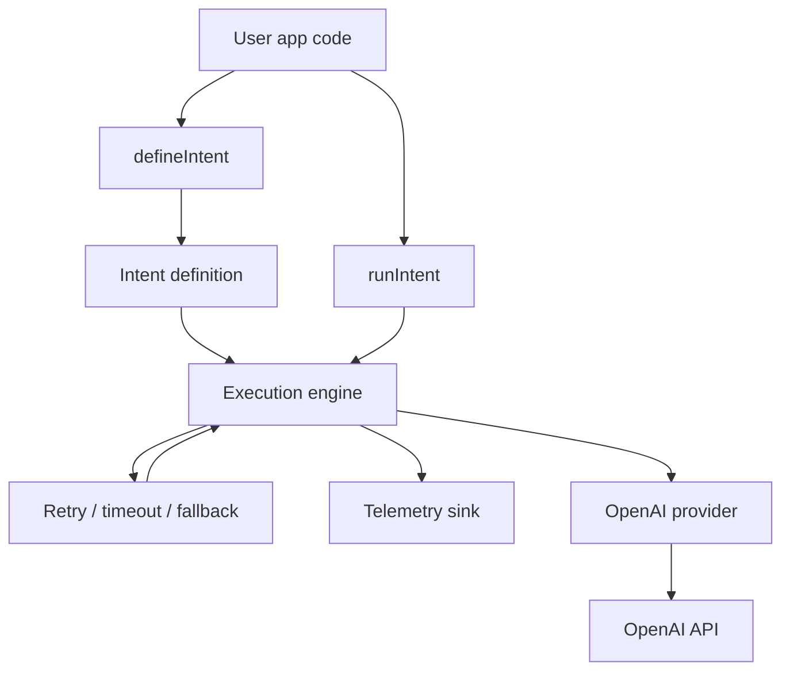

# fabricks-ai-reliability-layer
[](https://www.npmjs.com/package/fabricks-ai-reliability-layer)

[](https://github.com/NeverEverFelix/fabricks-ai-reliability-layer/actions)

[](./LICENSE)

[](https://github.com/NeverEverFelix/fabricks-ai-reliability-layer/actions)

Reliable, intent-driven execution for LLM workflows — with built-in retries, timeouts, fallbacks, and structured telemetry.

The AI Reliability Layer acts like a service mesh for AI workflows: it centralizes retries, timeouts, fallbacks, provider routing, and telemetry for all LLM/API calls, removing this logic from application code and enforcing consistent reliability across every step of a workflow.

In short:  
**You focus on your workflow’s intent.  
The library guarantees it runs predictably.**

---

## Features

- **Intent-based workflow definition** — describe what your workflow should do, not how to orchestrate it.
- **Retries, timeouts, and fallbacks built in** — stabilize flaky LLM calls.
- **Deterministic execution engine** — every run produces a clear, ordered trace.
- **Structured telemetry events** — observe step starts, finishes, retries, and fallbacks.
- **Lightweight OpenAI provider** — tiny adapter for reliable model calls without heavy SDKs.
- **Minimal API surface** — define an intent, run it, inspect the result.
- **Easy to test** — inject fake providers or override execution behavior.
- **Fast and focused** — no bloat; reliability primitives only.

---

## Installation

```bash
npm install fabricks-ai-reliability-layer
```

---

## Quick Start

```ts
import { defineIntent, runIntent } from "fabricks-ai-reliability-layer";

const greetIntent = defineIntent<{ name: string }, string>({
  name: "greet",
  steps: [
    {
      id: "sayHello",
      async run(ctx) {
        return `Hello, ${ctx.input.name}!`;
      },
    },
  ],
  entryStepId: "sayHello",
});

async function main() {
  const result = await runIntent(greetIntent, {
    input: { name: "Felix" },
    telemetry: console.log,
  });

  console.log(result.output); // "Hello, Felix!"
}

main().catch(console.error);
```

---

## Example: Reliable OpenAI Question Answering

```ts
import { defineIntent, runIntent } from "fabricks-ai-reliability-layer";

const answerIntent = defineIntent<{ question: string }, string>({
  name: "answer-intent",
  steps: [
    {
      id: "ask-primary",
      retry: { maxAttempts: 2 },
      timeoutMs: 5000,
      fallbackTo: "ask-fallback",
      async run(ctx) {
        const response = await ctx.providers.openai.chat({
          model: "gpt-4.1-mini",
          messages: [
            { role: "system", content: "You are a concise assistant." },
            { role: "user", content: ctx.input.question },
          ],
        });

        return response.content;
      },
    },
    {
      id: "ask-fallback",
      async run(ctx) {
        const response = await ctx.providers.openai.chat({
          model: "gpt-4o-mini",
          messages: [
            { role: "system", content: "Fallback model. Be brief." },
            { role: "user", content: ctx.input.question },
          ],
        });

        return response.content;
      },
    },
  ],
  entryStepId: "ask-primary",
});

async function main() {
  const result = await runIntent(answerIntent, {
    input: { question: "Why Kaniko over DinD?" },
    providers: {
      openai: myReliableOpenAIProvider,
    },
  });

  console.log(result.output);
}

main().catch(console.error);
```

---

## Architecture Overview



---
## API Reference

### `defineIntent`

Creates a named workflow composed of ordered steps with optional reliability policies.

```ts
import { defineIntent } from "fabricks-ai-reliability-layer";

const intent = defineIntent<Input, Output>({
  name: "my-intent",
  steps: [
    // StepDefinition<Input, Output>
  ],
  entryStepId: "primary-step", // optional, defaults to first step
});

```

### `runIntent(intent, input, options?)`

Executes an intent with the given input.

Applies retry/timeout/fallback rules
Produces a deterministic execution trace
Emits telemetry events as steps run

``` ts
const result = await runIntent(intent, input, {
  onEvent?: (event: TelemetryEvent) => void,
});
```
---
## Core Types

### `StepDefinition`

Represents a single unit of work in an intent.

```ts
interface StepDefinition<Input = unknown, Output = unknown> {
  id: string;
  run: (ctx: ExecutionContext<Input>) => Promise<Output>;

  // Optional reliability policies (per-step)
  retry?: {
    maxAttempts: number; // total attempts, including the first
  };

  timeoutMs?: number;     // maximum allowed runtime for this step
  fallbackTo?: string;    // ID of another step to jump to on failure
}
```
### `ExecutionContext`

Passed into every step’s `run` handler.

```ts
interface ExecutionContext<Input = unknown> {
  input: Input;

  providers?: {
    openai?: OpenAIProvider;
    // user-defined providers can be added here
  };

  telemetry?: TelemetrySink;

  metadata?: Record<string, unknown>;
}
```
### `ExecutionResult`

Returned from `runIntent`.

```ts
interface ExecutionResult<Output = unknown> {
  intentName: string;
  success: boolean;
  output?: Output;
  error?: unknown;
  trace: TelemetryEvent[];
}
```
### `TelemetryEvent` and `TelemetrySink`

Structured events emitted during execution.

```ts
type TelemetryEventType =
  | "intent_started"
  | "intent_finished"
  | "step_started"
  | "step_finished"
  | "retry_attempt_started"
  | "retry_attempt_failed";

interface TelemetryEvent {
  type: TelemetryEventType;
  intentName: string;
  timestamp: number;

  stepId?: string;   // present for step-related events
  success?: boolean; // for step_finished / intent_finished
  attempt?: number;  // for retry events
  error?: unknown;   // when an error occurred
}

type TelemetrySink = (event: TelemetryEvent) => void;
```
---
## Provider Interface

The engine only assumes that `ctx.providers.openai` implements a tiny, stable interface.

### OpenAI Provider Contract

```ts
export interface OpenAIProviderClient {
  chat(params: ChatParameters): Promise<{ content: string }>;
}

export interface ChatParameters {
  prompt: string;
  model?: string;
}
```
### Built-in `createOpenAIProvider`

This package includes a small helper to create a provider from an API key:

```ts
import {
  createOpenAIProvider,
  type OpenAIProviderClient,
} from "fabricks-ai-reliability-layer";

const openai: OpenAIProviderClient = createOpenAIProvider({
  apiKey: process.env.OPENAI_API_KEY!,
  baseUrl: "https://api.openai.com/v1",    // optional, defaults provided
  defaultModel: "gpt-4.1-mini",            // optional, defaults provided
});
```
### Configuration Shape

```ts
export interface OpenAiProviderConfig {
  apiKey: string;
  baseUrl?: string;
  defaultModel?: string;
}
```
### Injecting into `runIntent`

```ts
const result = await runIntent(answerIntent, {
  input: { question: "Why Kaniko over DinD?" },
  providers: { openai },
});
```

---
### Advanced Usage


1. You can combine multiple OpenAI calls into a single reliable intent.  
Below is an example that:

1. **Classifies** the user’s question.
2. **Drafts** an answer using that classification (with retry + timeout).

```ts
import { defineIntent, runIntent } from "fabricks-ai-reliability-layer";
import {
  createOpenAIProvider,
  type OpenAIProviderClient,
} from "fabricks-ai-reliability-layer";

// Create a provider instance (once, at the edge or in your backend)
const openai: OpenAIProviderClient = createOpenAIProvider({
  apiKey: process.env.OPENAI_API_KEY!,
  baseUrl: "https://api.openai.com/v1",
  defaultModel: "gpt-4.1-mini",
});

// Multi-step intent
const multiStepQaIntent = defineIntent<{ question: string }, string>({
  name: "multi-step-qa",
  steps: [
    {
      id: "classify-question",
      async run(ctx) {
        const res = await ctx.providers!.openai!.chat({
          model: "gpt-4.1-mini",
          prompt: [
            {
              role: "system",
              content:
                "Classify the user's question as one of: 'how-to', 'definition', 'comparison', or 'other'. " +
                "Reply with just the label.",
            },
            { role: "user", content: ctx.input.question },
          ],
        });

        // Store the classification in metadata for downstream steps
        ctx.metadata = {
          ...ctx.metadata,
          questionType: res.content.trim(),
        };

        return res.content;
      },
    },

    {
      id: "draft-answer",
      retry: { maxAttempts: 2 }, // automatic retry on failure
      timeoutMs: 8000,           // fail fast if the model is too slow
      async run(ctx) {
        const questionType = ctx.metadata?.questionType ?? "other";

        const res = await ctx.providers!.openai!.chat({
          model: "gpt-4.1-mini",
          messages: [
            {
              role: "system",
              content: `You are a senior engineer. The question type is "${questionType}". ` +
                       "Answer concisely in under 6 sentences.",
            },
            { role: "user", content: ctx.input.question },
          ],
        });

        // This becomes the final output of the intent
        return res.content;
      },
    },
  ],
  entryStepId: "classify-question",
});

// Running the multi-step workflow
async function main() {
  const result = await runIntent(multiStepQaIntent, {
    input: { question: "Why would you choose Kaniko over Docker-in-Docker for CI builds?" },
    providers: { openai },
    telemetry: (event) => {
      console.log("[qa telemetry]", event);
    },
  });

  if (result.success) {
    console.log("Final answer:", result.output);
  } else {
    console.error("Intent failed:", result.error);
  }
}

main().catch(console.error);
```
---
## Design Philosophy

AI systems fail in ways traditional software doesn't: they time out, return inconsistent results, exceed rate limits, or degrade silently over time.

This library provides a **reliability-first foundation** for building predictable AI workflows using simple, intent-based abstractions.

It follows three principles:

1. **Intent over mechanics** — you describe *what*, the engine decides *how*.
2. **Small surface area, strong guarantees** — deterministic execution, graceful degradation, transparent observability.
3. **Business resilience as a first-class goal** — stable AI behavior leads to stable products.

---
## What’s Next for This Library

This release focuses on a small, reliable core: intents, steps, retries, timeouts, fallbacks, and telemetry.  
Next iterations will grow the library **horizontally** (more integrations) and **vertically** (richer reliability features) without breaking the existing API.

Planned areas of development:

### 1. Engine & Telemetry

- **Richer telemetry fields**  
  - Per-step durations and attempt counts  
  - Clearer error metadata and failure reasons  
- **Improved traces**  
  - More explicit step result metadata in `trace`  
  - Easier correlation with logs / request IDs  

### 2. Workflow Capabilities

- **Full DAG support**  
  - `dependsOn` relationships between steps  
  - Static cycle detection and validation  
  - Fan-out / fan-in semantics on top of the current linear model  
- **Parallel execution**  
  - Run independent steps concurrently with concurrency limits  
  - Clear guarantees around ordering and telemetry when parallelized  

### 3. Reliability Features

- **Budgets and envelopes**  
  - Latency budgets per intent / step  
  - Soft cost ceilings (e.g. token or dollar budgets)  
- **Circuit breakers & backoff**  
  - Temporarily trip a provider or step when failure rates spike  
  - Smarter retry strategies (exponential backoff, jitter)  

### 4. Providers & Integrations

- **Additional providers** behind the same contract  
  - Generic HTTP provider for calling arbitrary REST APIs as steps  
  - Additional LLM providers (e.g. Anthropic-style clients)  
- **Better testing utilities**  
  - Helper functions for building fake providers and deterministic tests  

### 5. Tooling & Ecosystem

- **CI & release automation**  
  - Stable test matrix across Node LTS versions  
  - Automated semantic versioning and changelog generation  
- **Docs & examples**  
  - More end-to-end examples (backend API, queue workers, cron jobs)  
  - Guides for plugging into common logging / metrics stacks  

The goal is to keep the **core mental model unchanged**—intents, steps, policies, telemetry—while steadily adding power and ergonomics around it.


## License

MIT
